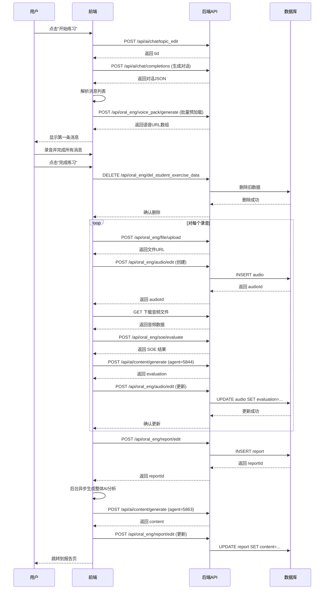
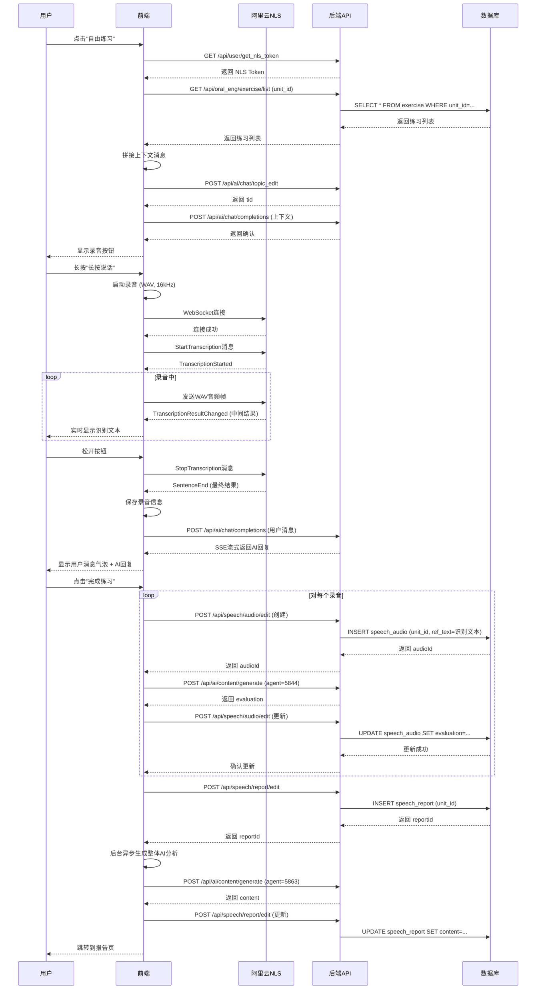

# 📚 对话练习完整逻辑文档

**生成时间**: 2025-01-28  
**涵盖范围**: 结构化练习 + 自由对话两种模式

---

## 目录

1. [系统架构](#系统架构)
2. [结构化练习模式](#结构化练习模式)
3. [自由对话模式](#自由对话模式)
4. [技术实现细节](#技术实现细节)
5. [API调用流程](#api调用流程)
6. [数据流转](#数据流转)
7. [状态管理](#状态管理)

---

## 系统架构

### 模式分类

```
对话练习系统
    ├── 结构化练习 (Structured Mode)
    │   ├── 基于预设练习内容
    │   ├── AI角色扮演
    │   ├── 有明确的Q&A序列
    │   └── 完成后生成详细报告
    │
    └── 自由对话 (Free Mode)
        ├── 基于单元知识点
        ├── 无预设对话流程
        ├── 实时语音识别
        └── 灵活的对话形式
```

### 核心组件

| 组件 | 职责 | 关键技术 |
|------|------|----------|
| **Conversation页面** | 对话交互主界面 | React Component, Taro |
| **TaroVoiceRecognitionService** | 实时语音识别 | WebSocket, NLS |
| **RecorderManager** | 录音管理 | Taro Recorder API |
| **InnerAudioContext** | 音频播放 | Taro Audio API |
| **API Layer** | 后端通信 | REST API, SSE |

---

## 结构化练习模式

### 一、前端交互场景

#### 场景1: 进入练习

```
用户操作流程：
1. 从练习详情页点击"开始练习"
2. 系统跳转到对话练习页
3. 展示练习信息（标题、描述、词汇等）
4. 用户选择角色（提问者/回答者）
5. 点击"生成练习"按钮
```

**UI展示**:
- 📝 练习信息卡片（可折叠）
- 🎭 角色选择按钮
- 🚀 生成练习按钮
- 👤 学生姓名显示

#### 场景2: 生成对话

```
系统处理流程：
1. ✅ 验证学生登录状态
2. 📥 从本地存储读取练习详情
3. 🔄 调用 topic_edit API 创建对话话题 (tid)
4. 🤖 调用 completions API 生成AI对话内容
5. 📊 解析对话JSON，构建消息列表
6. 🎵 预加载所有AI消息的数字人语音
7. 📺 展示第一条消息
```

**关键代码** (`loadConversation`方法):
```typescript
// 步骤1: 创建对话话题
const topicResult = await aiChatAPI.topicEdit()
const tid = topicResult.data?.id || topicResult.result?.id

// 步骤2: 生成对话内容
const query = `练习内容: ${exerciseContent}\n词汇: ${vocabs}\n角色: ${selectedRole}`
const contentResult = await aiChatAPI.completions({
  tid: tid,
  text: query,
  files: [],
  agent_id: 5864,
  ai_config: { agent_id: 5864 }
})

// 步骤3: 解析对话JSON
const conversationData = JSON.parse(content)
const messages = conversationData.conversation.map(...)

// 步骤4: 预加载数字人语音
await this.preloadAllDigitalVoices(messages)
```

#### 场景3: 对话交互

##### 3.1 用户轮次

**用户操作**:
```
1. 点击"开始录音"按钮
2. 系统弹出录音模态框
3. 用户说话（录音中）
4. 点击"停止"或"重新录音"
5. 录音完成后显示录音气泡
```

**系统处理**:
```typescript
// 开始录音
recorderManager.start({
  duration: 60000,
  sampleRate: 16000,
  numberOfChannels: 1,
  format: 'wav'
})

// 录音停止
recorderManager.onStop((res) => {
  // 保存录音信息
  recordedMessages[messageId] = {
    voiceUrl: res.tempFilePath,
    localFilePath: res.tempFilePath,
    duration: res.duration / 1000,
    messageText: message.text
  }
  
  // 自动触发AI回复（仅首次录音）
  if (!isReRecording) {
    this.startAIResponse()
  }
})
```

##### 3.2 AI轮次

**系统自动执行**:
```
1. 📺 展示AI消息文本（流式效果）
2. 🎵 播放预加载的数字人语音
3. 🔄 自动滚动到当前消息
4. ⏭️  准备下一轮用户输入
```

**流式输出实现**:
```typescript
// 模拟流式输出
let index = 0
const streamInterval = setInterval(() => {
  if (index < fullText.length) {
    const displayText = fullText.substring(0, index + 1)
    this.setState({
      messages: messages.map(m => 
        m.id === messageId 
          ? { ...m, text: displayText, isStreaming: true }
          : m
      )
    })
    index++
  } else {
    clearInterval(streamInterval)
    // 播放数字人语音
    this.playDigitalVoice(messageId, fullText)
  }
}, 30)
```

#### 场景4: 完成练习

**用户操作**:
```
用户录完所有消息后 → 点击"完成练习"按钮
```

**系统处理流程**（5个关键步骤）:

```
步骤1: 清除旧数据 ⚠️
    ↓
    调用 DELETE /api/oral_eng/del_student_exercise_data
    传参: student_id, exercise_id, is_free=false
    目的: 删除该学生该练习的所有旧音频和报告

步骤2: 批量上传录音 📤
    ↓
    对每个录音消息:
    2.1 上传文件 → fileAPI.uploadFile()
    2.2 保存记录 → audioAPI.editAudio({
        student_id,
        exercise_id,
        file: fileUrl,
        duration,
        message_text,
        ref_text: message_text.replace(/^[QA]:\s*/, ''),
        is_free: false,
        evaluation: ''
    })
    2.3 收集 audioId

步骤3: 逐个评测并生成评价 🎯
    ↓
    对每个上传的音频:
    3.1 下载音频 → Taro.downloadFile()
    3.2 SOE评测 → soeAPI.evaluate([localPath], [refText])
    3.3 生成评价 → contentAPI.generate(5844, soeJsonQuery)
    3.4 更新记录 → audioAPI.editAudio({
        id: audioId,
        evaluation: evaluation  // 保存生成的评价
    })
    3.5 收集所有 evaluation 内容

步骤4: 保存报告 💾
    ↓
    reportAPI.editReport({
        student_id,  // ⚠️ 必填
        exercise_id,
        name: '练习评测报告',
        audio_ids: [audioId1, audioId2, ...],
        summary: '自动生成的评测报告',
        json_content: JSON.stringify({
            exercise_id,
            audio_ids,
            timestamp,
            soe_results: [...]
        })
    })
    获取 reportId

步骤5: 后台生成AI分析建议 🤖 (异步)
    ↓
    this.generateOverallContentInBackground(
        reportId, studentId, exerciseId,
        reportData, audioIds, jsonContent,
        allEvaluations
    )
    
    后台执行:
    5.1 拼接所有 evaluation
    5.2 调用 contentAPI.generate(5863, allEvaluationsText)
    5.3 更新 report 的 content 字段

完成 ✅
    ↓
    跳转到 /pages/report/index?exerciseId={exerciseId}
```

### 二、后端实现

#### API端点清单

| 序号 | API | 方法 | 说明 | 关键参数 |
|------|-----|------|------|----------|
| 1 | `/api/ai/chat/topic_edit` | POST | 创建对话话题 | - |
| 2 | `/api/ai/chat/completions` | POST | 生成AI对话 | tid, text, agent_id=5864 |
| 3 | `/api/oral_eng/file/upload` | POST | 上传音频文件 | file (FormData) |
| 4 | `/api/oral_eng/audio/edit` | POST | 创建/更新音频记录 | student_id, exercise_id, file, duration, ref_text, is_free, evaluation |
| 5 | `/api/oral_eng/soe/evaluate` | POST | SOE语音评测 | voiceFileUrls[], refTexts[], voiceFormat='wav' |
| 6 | `/api/ai/content/generate` | POST | 生成内容 | agent_id (5844/5863), query |
| 7 | `/api/oral_eng/report/edit` | POST | 创建/更新报告 | student_id, exercise_id, audio_ids[], json_content, content |
| 8 | `/api/oral_eng/del_student_exercise_data` | DELETE | 删除练习数据 | student_id, exercise_id, is_free=false |
| 9 | `/api/oral_eng/voice_pack/generate` | POST | 生成数字人语音 | text |

#### 数据库表结构

**`audio` 表** (结构化练习音频):
```sql
CREATE TABLE audio (
    id INT AUTO_INCREMENT PRIMARY KEY,
    student_id INT NOT NULL,
    exercise_id INT NOT NULL,
    file VARCHAR(512),           -- 音频文件URL
    duration DECIMAL(10,2),      -- 时长（秒）
    message_text TEXT,           -- 消息文本（带Q:/A:前缀）
    ref_text TEXT,               -- 参考文本（去前缀，用于SOE）
    is_free BOOLEAN DEFAULT 0,   -- 是否自由练习
    evaluation TEXT,             -- AI评价内容
    created_at TIMESTAMP DEFAULT CURRENT_TIMESTAMP,
    updated_at TIMESTAMP DEFAULT CURRENT_TIMESTAMP ON UPDATE CURRENT_TIMESTAMP,
    INDEX idx_student_exercise (student_id, exercise_id, is_free)
);
```

**`report` 表** (评测报告):
```sql
CREATE TABLE report (
    id INT AUTO_INCREMENT PRIMARY KEY,
    student_id INT NOT NULL,     -- ⚠️ 必填字段
    exercise_id INT NOT NULL,
    name VARCHAR(255),
    audio_ids JSON,              -- 音频ID数组
    summary TEXT,                -- 摘要
    json_content LONGTEXT,       -- 详细JSON数据
    content TEXT,                -- 整体AI分析建议
    created_at TIMESTAMP DEFAULT CURRENT_TIMESTAMP,
    updated_at TIMESTAMP DEFAULT CURRENT_TIMESTAMP ON UPDATE CURRENT_TIMESTAMP,
    INDEX idx_student_exercise (student_id, exercise_id)
);
```

---

## 自由对话模式

### 一、前端交互场景

#### 场景1: 进入自由对话

```
用户操作流程：
1. 从练习详情页点击"自由练习"按钮
2. 系统跳转到对话练习页（带参数 mode=free&unitId=xxx）
3. 自动初始化自由对话（跳过角色选择）
```

**初始化流程** (`startFreeConversation`):
```
步骤1: 获取 NLS Token
    ↓
    nlsAPI.getNlsToken()
    
步骤2: 初始化语音识别服务
    ↓
    voiceService = new TaroVoiceRecognitionService({
        token: nlsToken,
        appKey: nlsAppKey,
        onResult: this.handleVoiceResult,
        onError: this.handleVoiceError
    })

步骤3: 获取单元所有练习
    ↓
    exerciseAPI.getExerciseList({ unit_id: unitId })

步骤4: 拼接上下文消息
    ↓
    contextText = exercises.map(ex => 
        `vocabs:${ex.vocabs},content:${ex.content}`
    ).join(',')

步骤5: 创建对话话题
    ↓
    aiChatAPI.topicEdit() → tid

步骤6: 发送上下文消息（后台）
    ↓
    aiChatAPI.completions({
        tid, 
        text: contextText, 
        agent_id: 5864
    })
    ⚠️ 不显示在对话框中
```

#### 场景2: 语音交互

##### 2.1 长按录音

**用户操作**:
```
1. 👆 长按"长按说话"按钮
2. 🎤 开始录音（按钮变红，显示"松开发送"）
3. 🗣️ 说话（实时识别文本显示在顶部）
4. ☝️ 松开按钮
5. ✅ 录音完成，发送消息
```

**系统处理**:
```typescript
// 长按开始
handleLongPressStart = () => {
  this.longPressTimer = setTimeout(() => {
    this.setState({ isLongPressing: true })
    this.voiceService?.start()  // 开始语音识别
    this.recordingStartTime = Date.now()
  }, 100)
}

// 长按结束
handleLongPressEnd = async () => {
  clearTimeout(this.longPressTimer)
  
  if (!this.state.isLongPressing) return
  
  this.setState({ isLongPressing: false })
  this.voiceService?.stop()  // 停止语音识别
  
  const duration = (Date.now() - this.recordingStartTime) / 1000
  const { userInputText } = this.state
  const wavFilePath = this.voiceService?.getWavFilePath() || ''
  
  if (userInputText) {
    // 发送消息（带录音）
    await this.sendFreeMessageWithRecording(
      userInputText, 
      duration, 
      wavFilePath
    )
  }
}
```

##### 2.2 实时语音识别

**技术栈**:
- **阿里云 NLS** (Natural Language Speech)
- **WebSocket** 实时通信
- **WAV 格式** 音频流

**识别流程**:
```
录音开始
    ↓
WebSocket 连接 NLS Gateway
    ↓
发送 StartTranscription 消息 {
    format: 'wav',
    sample_rate: 16000,
    enable_intermediate_result: true
}
    ↓
onFrameRecorded 回调 (每1KB)
    ↓
发送 WAV 音频帧到 WebSocket
    ↓
接收 NLS 识别结果
    ├── TranscriptionResultChanged (中间结果)
    │   → 更新 userInputText
    └── SentenceEnd (句子结束)
        → 最终识别文本
    ↓
录音停止
```

**关键代码** (`TaroVoiceRecognitionService.ts`):
```typescript
// 开始录音
this.recorderManager.start({
  duration: 60000,
  sampleRate: 16000,
  numberOfChannels: 1,
  format: 'wav',  // WAV 格式
  frameSize: 1    // 每1KB返回一次
})

// 处理音频帧
this.recorderManager.onFrameRecorded((res) => {
  // 直接发送 WAV 数据到 NLS
  Taro.sendSocketMessage({
    data: res.frameBuffer
  })
})

// 处理识别结果
Taro.onSocketMessage((res) => {
  const message = JSON.parse(res.data)
  
  if (message.header.name === 'TranscriptionResultChanged') {
    // 中间结果，实时更新
    this.callbacks.onResult?.(message.payload.result)
  } else if (message.header.name === 'SentenceEnd') {
    // 句子结束，最终结果
    this.callbacks.onResult?.(message.payload.result)
  }
})
```

##### 2.3 发送消息

**处理流程** (`sendFreeMessageWithRecording`):
```typescript
// 1. 创建用户消息
const userMessage = {
  id: userMessageId,
  text: text,              // 识别文本
  isUser: true,
  audioPath: wavFilePath,  // WAV 文件路径
  duration: duration       // 录音时长
}

// 2. 保存到自由对话录音记录
this.setState({
  freeRecordedMessages: {
    ...freeRecordedMessages,
    [userMessageId]: {
      recognizedText: text,
      duration: duration,
      wavFilePath: wavFilePath
    }
  }
})

// 3. 添加到消息列表
this.setState({
  messages: [...messages, userMessage]
})

// 4. 调用AI生成回复
const result = await aiChatAPI.completions({
  tid: this.state.tid,
  text: text,
  files: [],
  agent_id: 5864,
  ai_config: { agent_id: 5864 }
})

// 5. 解析并展示AI回复（模拟流式）
const aiMessage = {
  id: Date.now(),
  text: aiContent,
  isUser: false,
  isStreaming: true
}

this.setState({
  messages: [...messages, aiMessage]
})
```

#### 场景3: 完成自由练习

**用户操作**:
```
用户对话完成后 → 点击"完成练习"按钮
```

**系统处理流程** (`handleCompleteFreeExercise`):

```
步骤1: 遍历所有录音
    ↓
    对每个 freeRecordedMessages[messageId]:

步骤1.1: 创建 speech_audio 记录
    ↓
    speechAudioAPI.editAudio({
        unit_id: unitId,  // ⚠️ 使用 unit_id，不是 exercise_id
        student_id: studentId,
        file: '',  // 暂不上传文件
        duration: recordData.duration,
        ref_text: recordData.recognizedText,  // ⚠️ 识别文本
        evaluation: ''
    })
    获取 audioId

步骤1.2: 生成 AI 评价
    ↓
    query = `用户说了: "${recognizedText}"\n时长: ${duration}秒\n请给出简短的英语口语评价。`
    contentAPI.generate(5844, query)
    获取 evaluation

步骤1.3: 更新 speech_audio 记录
    ↓
    speechAudioAPI.editAudio({
        id: audioId,
        unit_id: unitId,
        student_id: studentId,
        file: '',
        duration: recordData.duration,
        ref_text: recordData.recognizedText,
        evaluation: evaluation  // ⚠️ 保存评价
    })
    
步骤1.4: 收集 audioId 和 evaluation
    ↓
    audioIds.push(audioId)
    allEvaluations.push(evaluation)

步骤2: 创建 speech_report
    ↓
    speechReportAPI.editReport({
        unit_id: unitId,  // ⚠️ 使用 unit_id
        student_id: studentId,
        audio_ids: audioIds,
        content: ''  // 暂时为空
    })
    获取 reportId

步骤3: 后台生成整体 AI 分析建议 🤖 (异步)
    ↓
    this.generateFreeExerciseOverallContent(
        reportId, unitId, studentId,
        audioIds, allEvaluations
    )
    
    后台执行:
    3.1 拼接所有 evaluation
    3.2 调用 contentAPI.generate(5863, allEvaluationsText)
    3.3 更新 speech_report 的 content 字段

完成 ✅
    ↓
    跳转到 /pages/report/index?unitId={unitId}&mode=free
```

### 二、后端实现

#### 自由对话专用API

| 序号 | API | 方法 | 说明 | 关键参数 |
|------|-----|------|------|----------|
| 1 | `/api/user/get_nls_token` | GET | 获取NLS Token | - |
| 2 | `/api/speech/audio/list` | GET | 获取自由练习音频列表 | unit_id, student_id |
| 3 | `/api/speech/audio/detail` | GET | 获取音频详情 | id |
| 4 | `/api/speech/audio/edit` | POST | 创建/更新音频 | unit_id, student_id, file, duration, ref_text, evaluation |
| 5 | `/api/speech/audio/del` | DELETE | 删除音频 | id |
| 6 | `/api/speech/report/list` | GET | 获取报告列表 | unit_id, student_id |
| 7 | `/api/speech/report/detail` | GET | 获取报告详情 | id |
| 8 | `/api/speech/report/edit` | POST | 创建/更新报告 | unit_id, student_id, audio_ids[], content |
| 9 | `/api/speech/report/del` | DELETE | 删除报告 | id |

#### 数据库表结构

**`speech_audio` 表** (自由对话音频):
```sql
CREATE TABLE speech_audio (
    id INT AUTO_INCREMENT PRIMARY KEY,
    unit_id INT NOT NULL,        -- ⚠️ 使用 unit_id
    student_id INT NOT NULL,
    file VARCHAR(512),           -- 音频文件URL
    duration DECIMAL(10,2),      -- 时长（秒）
    ref_text TEXT,               -- 识别文本（用于SOE）
    evaluation TEXT,             -- AI评价内容
    created_at TIMESTAMP DEFAULT CURRENT_TIMESTAMP,
    updated_at TIMESTAMP DEFAULT CURRENT_TIMESTAMP ON UPDATE CURRENT_TIMESTAMP,
    INDEX idx_unit_student (unit_id, student_id)
);
```

**`speech_report` 表** (自由对话报告):
```sql
CREATE TABLE speech_report (
    id INT AUTO_INCREMENT PRIMARY KEY,
    unit_id INT NOT NULL,        -- ⚠️ 使用 unit_id
    student_id INT NOT NULL,
    audio_ids JSON,              -- 音频ID数组
    content TEXT,                -- 整体AI分析建议
    created_at TIMESTAMP DEFAULT CURRENT_TIMESTAMP,
    updated_at TIMESTAMP DEFAULT CURRENT_TIMESTAMP ON UPDATE CURRENT_TIMESTAMP,
    INDEX idx_unit_student (unit_id, student_id)
);
```

---

## 技术实现细节

### 1. 语音识别 (NLS)

#### WebSocket 通信协议

**连接URL**:
```
wss://nls-gateway.cn-shanghai.aliyuncs.com/ws/v1?token={nlsToken}
```

**开始识别消息**:
```json
{
  "header": {
    "appkey": "tRAwRgCPdmM3pqeJ",
    "namespace": "SpeechTranscriber",
    "name": "StartTranscription",
    "task_id": "32位无横杠UUID",
    "message_id": "32位无横杠UUID"
  },
  "payload": {
    "format": "wav",
    "sample_rate": 16000,
    "enable_intermediate_result": true,
    "enable_punctuation_prediction": true,
    "enable_inverse_text_normalization": true
  }
}
```

**音频数据发送**:
```typescript
// 直接发送 WAV 格式音频帧
Taro.sendSocketMessage({
  data: wavFrameBuffer  // ArrayBuffer
})
```

**识别结果接收**:
```json
// 中间结果
{
  "header": {
    "name": "TranscriptionResultChanged",
    "message_id": "...",
    "task_id": "..."
  },
  "payload": {
    "result": "Hello",
    "index": 1
  }
}

// 最终结果
{
  "header": {
    "name": "SentenceEnd",
    "message_id": "...",
    "task_id": "..."
  },
  "payload": {
    "result": "Hello world",
    "index": 1,
    "time": 2000
  }
}
```

**停止识别消息**:
```json
{
  "header": {
    "appkey": "tRAwRgCPdmM3pqeJ",
    "namespace": "SpeechTranscriber",
    "name": "StopTranscription",
    "task_id": "...",
    "message_id": "..."
  }
}
```

### 2. SOE 语音评测

#### 请求格式

```typescript
// FormData格式
const formData = {
  refText: "Hello world",           // 参考文本
  engineType: '16k_en',             // 引擎类型（16k英文）
  scoreCoeff: '1.0',                // 评分系数
  evalMode: '1',                    // 评测模式
  recMode: '1',                     // 录音模式
  voiceFormat: 'wav',               // ⚠️ 音频格式（WAV）
  voiceFileUrls: ["http://..."],    // 音频文件URL数组
  textMode: '0'                     // 文本模式
}
```

#### 响应格式

```json
{
  "success": true,
  "data": {
    "PronAccuracy": 85.5,      // 发音准确度
    "PronFluency": 90.2,       // 流利度
    "PronCompletion": 95.0,    // 完整度
    "Words": [
      {
        "Word": "Hello",
        "PronAccuracy": 88.0,
        "StressStatus": 1
      },
      {
        "Word": "world",
        "PronAccuracy": 83.0,
        "StressStatus": 0
      }
    ]
  }
}
```

### 3. AI内容生成

#### Agent类型

| Agent ID | 用途 | 输入 | 输出 |
|----------|------|------|------|
| **5844** | 单个音频评价 | SOE评测结果JSON | 评价文本 |
| **5863** | 整体AI分析建议（结构化） | 所有evaluation拼接 | 学习建议 |
| **5864** | 自由对话AI | 用户消息文本 | AI回复（SSE流式） |

#### SSE 流式输出

**请求**:
```typescript
POST /api/ai/chat/completions
{
  "tid": 12345,
  "text": "Hello",
  "files": [],
  "agent_id": 5864,
  "ai_config": { "agent_id": 5864 }
}
```

**响应格式**:
```
event:message
data:{"event":"message","content":"Hello","role":"assistant","task_id":"...","mid":"..."}

event:message
data:{"event":"message","content":" there","role":"assistant","task_id":"...","mid":"..."}

event:message
data:{"event":"message","content":"!","role":"assistant","task_id":"...","mid":"..."}

data:[DONE]
```

**前端解析**:
```typescript
// 1. 按 \n\n 分割SSE块
const chunks = rawData.split('\n\n')

// 2. 提取 content
for (const chunk of chunks) {
  const lines = chunk.split('\n')
  let dataContent = ''
  
  for (const line of lines) {
    if (line.startsWith('data:')) {
      dataContent = line.substring(5).trim()
    }
  }
  
  // 3. 检查 [DONE] 标记
  if (dataContent === '[DONE]') {
    break
  }
  
  // 4. 解析 JSON 并拼接 content
  if (dataContent) {
    const data = JSON.parse(dataContent)
    if (data.event === 'message' && data.content) {
      fullContent += data.content
    }
  }
}

// 5. 模拟流式输出到UI
let index = 0
const streamInterval = setInterval(() => {
  if (index < fullContent.length) {
    const displayText = fullContent.substring(0, index + 1)
    // 更新UI...
    index++
  } else {
    clearInterval(streamInterval)
  }
}, 30)
```

### 4. 数字人语音生成

#### 请求格式

```typescript
POST /api/oral_eng/voice_pack/generate
{
  "text": "Hello world"
}
```

#### 响应格式

```json
{
  "success": true,
  "data": {
    "url": "http://..../voice.mp3"  // ⚠️ 关键字段
  }
}
```

#### 预加载策略

```typescript
// 批量预加载所有AI消息的语音
preloadAllDigitalVoices = async (messages: any[]) => {
  const aiMessages = messages.filter(m => !m.isUser && m.text)
  const preloadedVoiceUrls: Record<number, string> = {}
  
  for (let i = 0; i < aiMessages.length; i++) {
    const message = aiMessages[i]
    try {
      const voiceResult = await voicePackAPI.generate({
        text: message.text
      })
      
      const voiceUrl = voiceResult.data?.url || voiceResult.result?.url
      
      if (voiceUrl) {
        preloadedVoiceUrls[message.id] = voiceUrl
      }
    } catch (error) {
      console.error('预加载语音失败:', error)
    }
  }
  
  this.setState({ preloadedVoiceUrls })
}
```

---

## API调用流程

### 结构化练习完整流程



### 自由对话完整流程



---

## 数据流转

### 结构化练习数据流

```
用户录音 (本地临时文件)
    ↓
上传文件 → fileAPI.uploadFile()
    ↓
获得 fileUrl
    ↓
保存到 audio 表
    ├── student_id
    ├── exercise_id
    ├── file: fileUrl
    ├── duration
    ├── message_text (带Q:/A:前缀)
    ├── ref_text (去前缀)
    ├── is_free: false
    └── evaluation: '' (暂时为空)
    ↓
获得 audioId
    ↓
下载文件 → Taro.downloadFile(fileUrl)
    ↓
SOE评测 → soeAPI.evaluate()
    ↓
获得 soeResult
    ↓
生成评价 → contentAPI.generate(5844, soeResult)
    ↓
获得 evaluation
    ↓
更新 audio 表
    └── evaluation: evaluation
    ↓
收集所有 audioId 和 evaluation
    ↓
保存到 report 表
    ├── student_id
    ├── exercise_id
    ├── audio_ids: [audioId1, audioId2, ...]
    ├── json_content: JSON.stringify(soeResults)
    └── content: '' (暂时为空)
    ↓
获得 reportId
    ↓
后台生成整体AI分析 → contentAPI.generate(5863, allEvaluations)
    ↓
获得 overallContent
    ↓
更新 report 表
    └── content: overallContent
```

### 自由对话数据流

```
用户长按录音
    ↓
实时语音识别 (NLS WebSocket)
    ├── 发送: WAV 音频帧
    └── 接收: 识别文本
    ↓
获得 recognizedText
    ↓
保存本地: freeRecordedMessages[messageId]
    ├── recognizedText
    ├── duration
    └── wavFilePath
    ↓
发送AI对话 → aiChatAPI.completions(recognizedText)
    ↓
获得 AI 回复 (SSE流式)
    ↓
显示对话
    ├── 用户: 录音气泡 + 识别文本
    └── AI: 流式文本
    ↓
用户点击"完成练习"
    ↓
遍历 freeRecordedMessages
    ↓
保存到 speech_audio 表
    ├── unit_id (⚠️ 不是 exercise_id)
    ├── student_id
    ├── file: '' (暂不上传)
    ├── duration
    ├── ref_text: recognizedText (⚠️ 识别文本)
    └── evaluation: '' (暂时为空)
    ↓
获得 audioId
    ↓
生成评价 → contentAPI.generate(5844, query)
    ↓
获得 evaluation
    ↓
更新 speech_audio 表
    └── evaluation: evaluation
    ↓
收集所有 audioId 和 evaluation
    ↓
保存到 speech_report 表
    ├── unit_id (⚠️ 不是 exercise_id)
    ├── student_id
    ├── audio_ids: [audioId1, audioId2, ...]
    └── content: '' (暂时为空)
    ↓
获得 reportId
    ↓
后台生成整体AI分析 → contentAPI.generate(5863, allEvaluations)
    ↓
获得 overallContent
    ↓
更新 speech_report 表
    └── content: overallContent
```

---

## 状态管理

### Component State

```typescript
state = {
  // === 通用状态 ===
  studentName: '学生',
  isLoadingConversation: false,
  showToast: false,
  toastText: '',
  scrollIntoViewId: '',
  
  // === 模式相关 ===
  mode: 'structured' | 'free',  // 对话模式
  
  // === 结构化练习专用 ===
  chapterId: '',
  exerciseId: '',
  currentExercise: null,
  messages: [],
  tid: null,
  selectedRole: 'questioner' | 'answerer',
  isFirstTime: true,
  isExerciseInfoExpanded: true,
  
  // 录音相关
  isRecording: false,
  showRecordingModal: false,
  currentRecordingMessageId: null,
  recordedMessages: {},  // { messageId: { voiceUrl, duration, messageText } }
  
  // AI回复相关
  isAIResponding: false,
  isStreaming: false,
  streamingText: '',
  streamingMessageId: null,
  
  // 语音播放相关
  isPlaying: false,
  playingVoiceId: null,
  voiceIconIndex: 0,
  playingDigitalVoiceId: null,
  digitalVoiceIconIndex: 0,
  preloadedVoiceUrls: {},  // { messageId: voiceUrl }
  
  // === 自由对话专用 ===
  unitId: '',
  userInputText: '',  // 实时识别填充
  isSendingMessage: false,
  
  // 语音识别相关
  nlsToken: '',
  nlsAppKey: 'tRAwRgCPdmM3pqeJ',
  isVoiceRecognizing: false,
  isLongPressing: false,
  currentRecordingPath: '',
  currentRecordingDuration: 0,
  freeRecordedMessages: {}  // { messageId: { recognizedText, duration, wavFilePath } }
}
```

### Instance Properties

```typescript
class Conversation extends Component {
  // 录音管理器
  recorderManager: any = null  // Taro.getRecorderManager()
  
  // 音频播放器
  audioContext: any = null  // 用户录音播放
  digitalVoiceContext: any = null  // 数字人语音播放
  
  // 动画定时器
  voiceAnimationTimer: any = null
  digitalVoiceAnimationTimer: any = null
  
  // 自由对话专用
  voiceService: any = null  // TaroVoiceRecognitionService 实例
  longPressTimer: any = null
  recordingStartTime: number = 0
}
```

---

## 关键差异对比

### 结构化 vs 自由对话

| 特性 | 结构化练习 | 自由对话 |
|------|-----------|---------|
| **练习基础** | exercise (练习) | unit (单元) |
| **对话流程** | 预设Q&A序列 | 无预设，自由交互 |
| **录音方式** | 点击按钮 → 模态框录音 | 长按录音按钮 |
| **语音识别** | ❌ 不需要 | ✅ 实时NLS识别 |
| **AI生成** | 一次性生成全部对话 | 逐条实时生成回复 |
| **数据表** | `audio` + `report` | `speech_audio` + `speech_report` |
| **关键字段** | `exercise_id`, `is_free=false` | `unit_id`, 无`is_free` |
| **ref_text来源** | 预设的消息文本（去Q:/A:前缀） | 实时语音识别文本 |
| **文件上传** | ✅ 上传WAV文件 | ❌ 暂不上传（仅记录本地路径） |
| **SOE评测** | ✅ 下载后评测 | ⚠️ 可选（当前未实现） |
| **Agent ID** | 5844(评价), 5863(总结) | 5844(评价), 5863(总结), 5864(对话) |

---

## 📋 总结

### 核心流程

1. **初始化** → 验证登录 → 读取参数 → 判断模式
2. **对话生成/开始** → 结构化: AI生成全部对话 | 自由: 发送上下文
3. **交互** → 结构化: 按序录音 | 自由: 长按录音+实时识别
4. **完成** → 上传音频 → SOE评测 → 生成评价 → 保存报告 → 后台生成AI分析

### 技术栈

- **前端**: Taro + React + TypeScript + SCSS
- **语音识别**: 阿里云 NLS (WebSocket)
- **语音评测**: 腾讯云 SOE
- **AI生成**: 自研 Agent (5844/5863/5864)
- **数字人语音**: 自研语音合成服务
- **音频格式**: WAV (16kHz, 16bit, 单声道)

### 关键点

1. ⚠️ **UUID格式**: NLS要求无横杠（`replace(/-/g, '')`）
2. ⚠️ **音频格式**: 统一使用 WAV
3. ⚠️ **ref_text**: 结构化=去前缀消息文本，自由=识别文本
4. ⚠️ **数据表**: 结构化用`audio`/`report`，自由用`speech_audio`/`speech_report`
5. ⚠️ **异步生成**: 整体AI分析在后台执行，不阻塞用户跳转
6. ⚠️ **is_free字段**: 结构化必须设置为`false`
7. ⚠️ **student_id**: report表的必填字段

---

**文档版本**: v1.0  
**最后更新**: 2025-01-28  
**维护者**: AI Assistant

